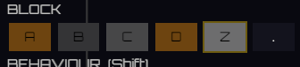

It could say next to „Block“ what it is, regular, …

Also we do not need the „.“ Block. It was in the text based level format to denote an empty position

## Notes

**As built** - `src/editor/palette.rs`, plus the four doc comments in
`src/editor/mod.rs` that said the right mouse button was a stopgap.

- **The block row's heading says which block is chosen, in words.** "BLOCK" gives
  up its right-hand end to `block_name` of whatever the brush is set to -
  "Regular, 1 hit", "Tough, 2 hits", "Concrete, 3 hits", "Regular, top only",
  "Obstacle, never breaks". The names are what tells the five apart in play,
  which is how much it takes to break them: `block_spawn` gives `Simple` one hit
  point, `Hardling` two, `Concrete` three, `SimpleTop` one but only from above,
  and an `Obstacle` is not `Hittable` at all.
- **One name at a time, and not under the swatches.** The five swatches share
  324 pixels, so each is 61 wide and "Obstacle, never breaks" is 195 - the words
  go where there is room for them. The heading was already there, already on the
  block row, and already had 260 pixels of nothing to its right.
- **It is a `ChosenBlock` item, not an `Entry`.** `palette_items` stays a pure
  layout function that knows nothing about the brush - the drawing is what reads
  it, as it already did for the `Brush   AA` row at the top - and a click on the
  name chooses nothing, because it says what is chosen rather than offering
  something to choose.
- **The `.` swatch is gone**, and with it `PaletteEntry::Block`'s `Option`. `.`
  in the token's *first* character is how a file says a cell is empty, not a
  block anybody paints, so the type no longer has a way to say it; the trigger's
  `Option` stays, because `.` in the *third* character is a real thing to paint -
  a block in no trigger at all. `Brush::erase` stays too: it is what
  `Brush::erasing()` is, and the right mouse button is now the only thing that
  picks one up, which it already was in practice.
- Five new tests, 278 green, build unchanged at 17 warnings, all pre-existing.
  Three pure - every block type having a name and no two sharing one, the
  heading keeping room beside it for one that a click does not land on, and
  nothing in the whole palette painting an empty cell. Two drive a real app: the
  name on screen following the chosen block through all five (and saying only
  that one), and the block row being five swatches with the right button still
  clearing a cell.
- Three mutations checked to fail: a block type with no name, the heading naming
  a fixed block rather than the chosen one, and choosing a block putting the
  erase brush down. One test each, plus two more for the third.
- **Checked in the running game**, because the one thing a headless test cannot
  answer is whether the name fits: with the brush on `ZA`, "Obstacle, never
  breaks" lays out at 194x18 inside its 236x26 node and "BLOCK" at 61x18 inside
  84x26 - one line each, 42 pixels of slack on the longest name there is. The
  row also drew five swatches and no sixth. (Read off `TextLayoutInfo` through a
  temporary system, since `screencapture` cannot reach the display from this
  session; how it *looks* rests on those numbers.)

## Review

### 2026-08-26T22:16:20 — pass

Checked: the card's two asks against the code, the diff of `0b68f7a`, `cargo test`, `cargo clippy --all-targets`, `cargo build` warnings.

- "It could say next to „Block“ what it is" is met: `block_name` in
  `src/editor/palette.rs:262` names all five types, `palette_items` puts a
  `PaletteItemKind::ChosenBlock` rect on the heading's own row beside "BLOCK"
  (`palette.rs:469-476`), and `editor_show_palette` draws `block_name` of
  `brush.block_type` into it (`palette.rs:739-754`). It follows the brush
  because `the_palette_is_out_of_date` already redraws on `brush.is_changed()`.
- Covered by tests that fail without the code:
  `every_block_type_has_a_name_in_words` and
  `the_block_heading_keeps_room_beside_it_for_the_name` (pure), and
  `the_block_row_says_in_words_which_block_is_chosen` in `src/editor/mod.rs`,
  which drives a real app through all five and asserts the palette says that
  name and no other block's.
- "We do not need the „.“ Block" is met: `PaletteEntry::Block` lost its
  `Option` (`palette.rs:82`), the `.chain([None])` is gone from both
  `palette_items` and `palette_entries`, and
  `every_letter_the_format_defines_is_in_the_palette` now pins the block row to
  `"ABCDZ"`. `the_block_row_has_no_swatch_for_the_empty_cell` checks the drawn
  row is five swatches and that the right button still clears a cell.
  `nothing_in_the_palette_paints_an_empty_cell` walks every entry the palette
  offers and asserts none of them sets `erase` or paints `EMPTY_SLOT`.
- The layout numbers in the notes check out from the constants:
  `ROW_WIDTH` = 150 + 110 + 2×26 + 3×4 = 324, so the name's rect is
  324 − 84 − 4 = 236 wide on a 26-high row, and five swatches share 324 at
  (324 − 4×4)/5 ≈ 61 each. The row's height is unchanged, so nothing below it
  moved.
- `cargo test`: 278 passed, 0 failed, 0 ignored. No test was weakened - the one
  test removed, `the_last_swatch_of_the_block_row_is_the_erase_brush`, asserted
  behaviour the card removes, and its replacement asserts more (every entry, not
  one). `exactly_one_entry_of_each_row_is_chosen` still exercises two block
  types.
- `cargo build`: 17 warnings, none in `src/editor`. `cargo clippy
  --all-targets` is noisy across the repo but flags nothing in
  `src/editor/palette.rs` or the changed part of `src/editor/mod.rs`; the
  `assert!(false)` it complains about is pre-existing in
  `src/level/layout/mod.rs:647`.
- The diff stays inside the What: `palette.rs`, the `Option` ripple through
  `mod.rs`'s tests, and the four doc comments that described the removed erase
  swatch. No debug code left behind. (Working tree also has an unrelated,
  uncommitted change in `src/materials/force_field.rs` and an untracked
  `src/diagnostics/` - neither is this card's.)
- Not verified: how it *looks* on screen. Like the implementer, I could not
  reach the display from this session, so the fit rests on the `TextLayoutInfo`
  numbers they recorded and on the constants above, not on a screenshot.

## Log

- 2026-08-26 status → in-progress (agent)
- 2026-08-26 status → review (agent)
- 2026-08-26 status → done (app)
